# Wein — Complete API Sequence Diagrams

This document contains the sequence diagrams for **every recommended endpoint** across all domains in the Wein application.

---

## 1. Authentication & Identity (`/api/auth`)

### 1.1 `POST /api/auth/login`
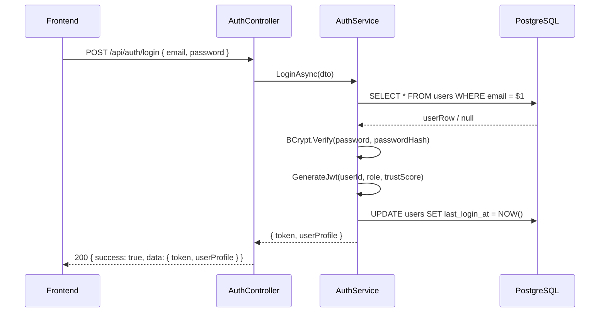

### 1.2 `POST /api/auth/register`
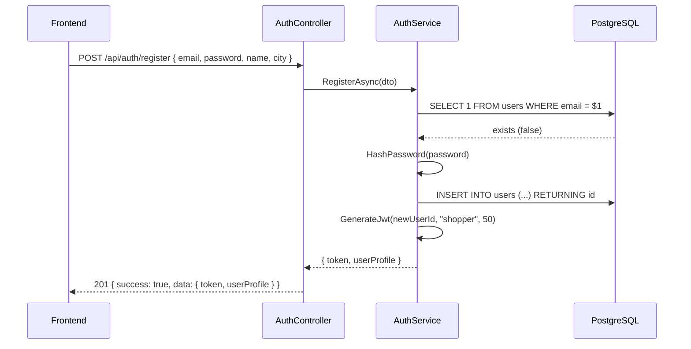

### 1.3 `GET /api/auth/me`
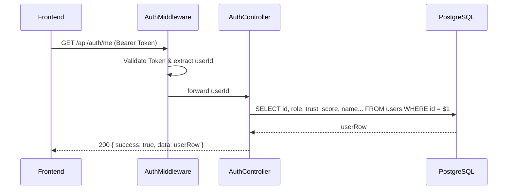

### 1.4 `POST /api/auth/logout`
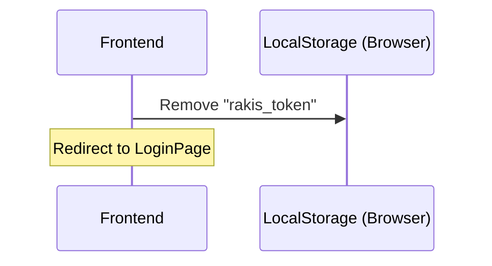

---

## 2. Public Prices & Search (`/api/prices`)

### 2.1 `GET /api/prices/search`
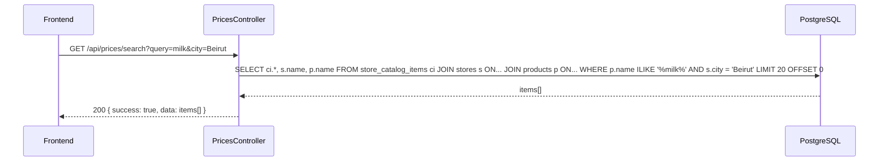

### 2.2 `GET /api/prices/product/{id}`
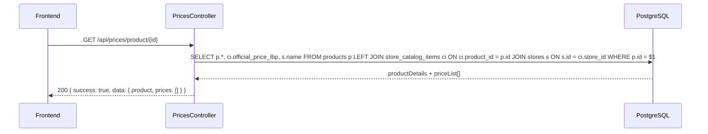

### 2.3 `GET /api/prices/{id}`
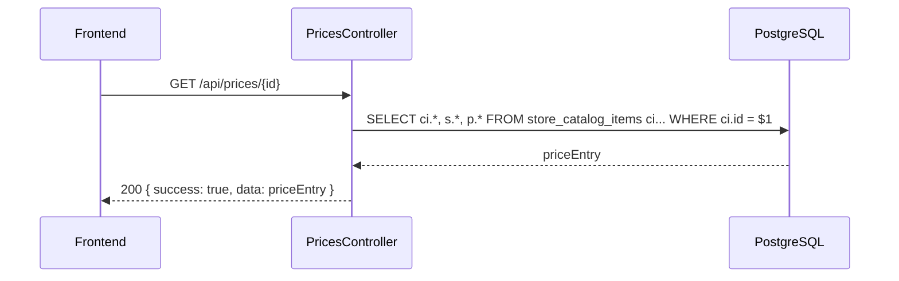

### 2.4 `POST /api/prices` (Community Submission)
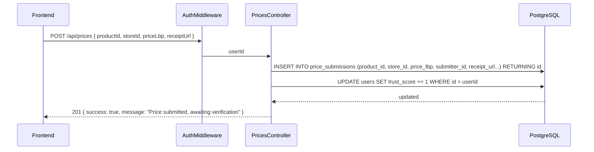

### 2.5 `POST /api/prices/{id}/vote`
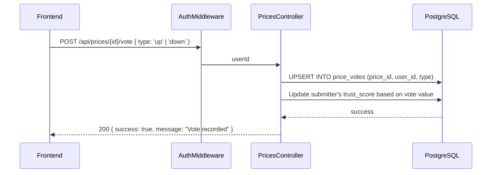

---

## 3. Retailer Catalog Management (`/api/catalog`)

### 3.1 `GET /api/catalog/store/{id}`
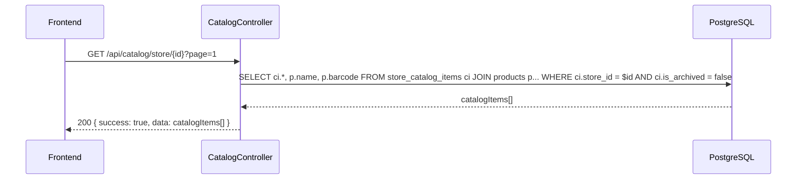

### 3.2 `GET /api/catalog/{id}`
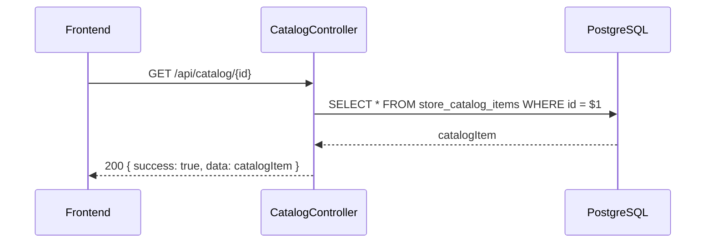

### 3.3 `POST /api/catalog`
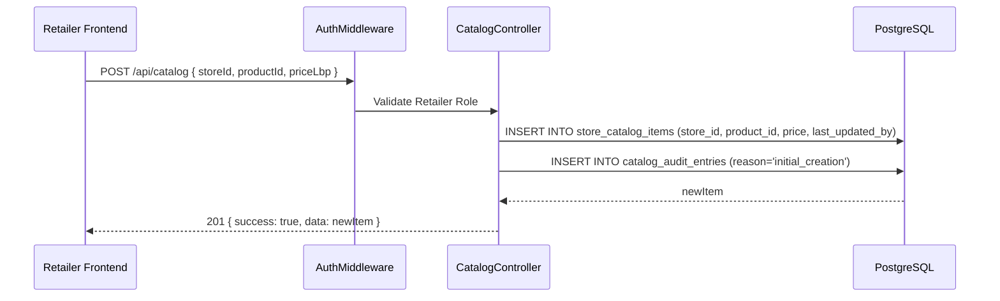

### 3.4 `PUT /api/catalog/{id}`
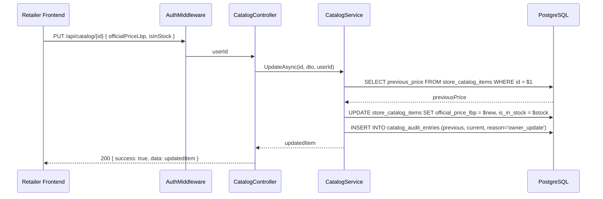

### 3.5 `DELETE /api/catalog/{id}`
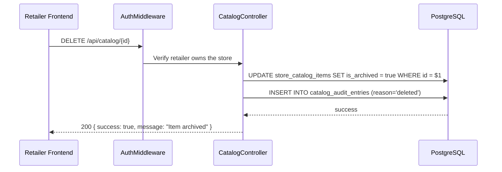

### 3.6 `POST /api/catalog/upload`
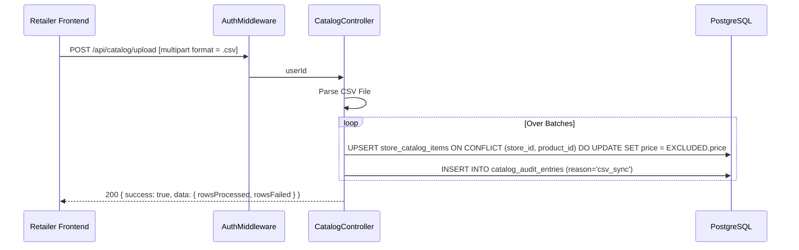

### 3.7 `GET /api/catalog/{id}/audit`
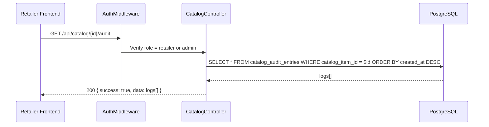

---

## 4. Discrepancy & Moderation (`/api/discrepancy`)

### 4.1 `POST /api/discrepancy`
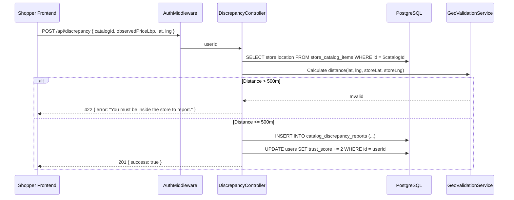

### 4.2 `GET /api/discrepancy/pending`
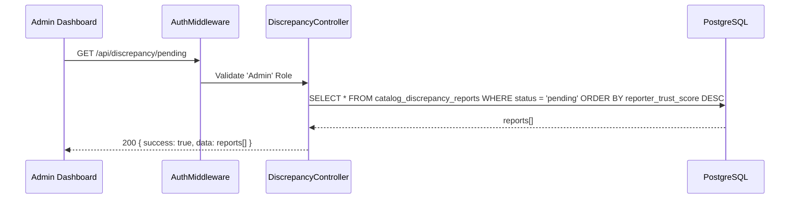

### 4.3 `GET /api/discrepancy/store/{id}`
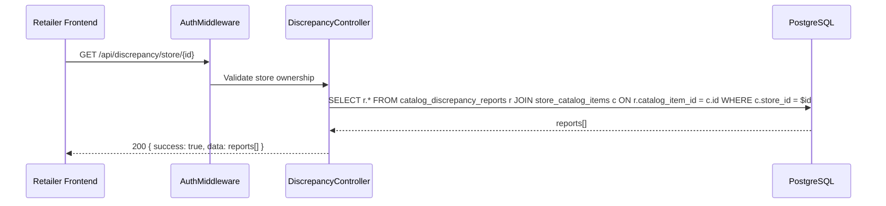

### 4.4 `PATCH /api/discrepancy/{id}/approve`
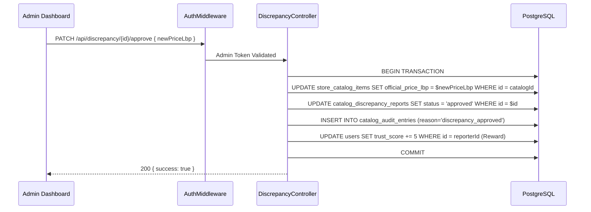

### 4.5 `PATCH /api/discrepancy/{id}/reject`
```mermaid
sequenceDiagram
  participant FE as Admin Dashboard
  participant AM as AuthMiddleware
  participant DC as DiscrepancyController
  participant DB as PostgreSQL

  FE->>AM: PATCH /api/discrepancy/{id}/reject
  AM->>DC: Admin Token Validated
  DC->>DB: UPDATE catalog_discrepancy_reports SET status = 'rejected' WHERE id = $id
  DC->>DB: UPDATE users SET trust_score -= 10 WHERE id = reporterId (Penalty)
  DC-->>FE: 200 { success: true }
```

---

## 5. Stores & Geography (`/api/stores`)

### 5.1 `GET /api/stores`
```mermaid
sequenceDiagram
  participant FE as Frontend Map
  participant SC as StoreController
  participant DB as PostgreSQL

  FE->>SC: GET /api/stores?city=Beirut
  SC->>DB: SELECT id, name, lat, lng, power_status, is_verified FROM stores WHERE city = 'Beirut' AND status = 'active'
  DB-->>SC: stores[]
  SC-->>FE: 200 { success: true, data: stores[] }
```

### 5.2 `GET /api/stores/{id}`
```mermaid
sequenceDiagram
  participant FE as Frontend
  participant SC as StoreController
  participant DB as PostgreSQL

  FE->>SC: GET /api/stores/{id}
  SC->>DB: SELECT * FROM stores WHERE id = $1
  DB-->>SC: store
  SC-->>FE: 200 { success: true, data: store }
```

### 5.3 `PUT /api/stores/{id}`
```mermaid
sequenceDiagram
  participant FE as Retailer Frontend
  participant AM as AuthMiddleware
  participant SC as StoreController
  participant DB as PostgreSQL

  FE->>AM: PUT /api/stores/{id} { internalRateLbp, isOpen }
  AM->>SC: Verify Retailer Owns Store
  SC->>DB: UPDATE stores SET internal_rate_lbp = $rate, is_open = $isOpen WHERE id = $id
  SC-->>FE: 200 { success: true, data: updatedStore }
```

### 5.4 `PATCH /api/stores/{id}/power`
```mermaid
sequenceDiagram
  participant FE as Retailer Frontend
  participant AM as AuthMiddleware
  participant SC as StoreController
  participant DB as PostgreSQL

  FE->>AM: PATCH /api/stores/{id}/power { powerStatus: 'stable' | 'unstable' }
  AM->>SC: Token check
  SC->>DB: UPDATE stores SET power_status = $status WHERE id = $id
  SC-->>FE: 200 { success: true }
```

### 5.5 `PATCH /api/stores/{id}/status`
```mermaid
sequenceDiagram
  participant FE as Admin Dashboard
  participant AM as AuthMiddleware
  participant SC as StoreController
  participant DB as PostgreSQL

  FE->>AM: PATCH /api/stores/{id}/status { status: 'suspended', isVerified: false }
  AM->>SC: 'Admin' Role Check
  SC->>DB: UPDATE stores SET status = $status, is_verified = $isVerified WHERE id = $id
  SC-->>FE: 200 { success: true }
```

---

## 6. Global Products (`/api/products`)

### 6.1 `GET /api/products`
```mermaid
sequenceDiagram
  participant FE as Frontend
  participant PC as ProductController
  participant DB as PostgreSQL

  FE->>PC: GET /api/products?search=bread&category=Bakery
  PC->>DB: SELECT * FROM products WHERE name ILIKE '%bread%' AND category = 'Bakery' LIMIT 50
  DB-->>PC: products[]
  PC-->>FE: 200 { success: true, data: products[] }
```

### 6.2 `GET /api/products/{id}`
```mermaid
sequenceDiagram
  participant FE as Frontend
  participant PC as ProductController
  participant DB as PostgreSQL

  FE->>PC: GET /api/products/{id}
  PC->>DB: SELECT * FROM products WHERE id = $id
  DB-->>PC: product
  PC-->>FE: 200 { success: true, data: product }
```

### 6.3 `GET /api/products/barcode/{code}`
```mermaid
sequenceDiagram
  participant FE as Frontend Scanner
  participant PC as ProductController
  participant DB as PostgreSQL

  FE->>PC: GET /api/products/barcode/528000...
  PC->>DB: SELECT * FROM products WHERE barcode = '528000...' LIMIT 1
  DB-->>PC: product
  alt Found
    PC-->>FE: 200 { success: true, data: product }
  else Not Found
    PC-->>FE: 404 { success: false, error: "Product not found" }
  end
```

### 6.4 `POST /api/products`
```mermaid
sequenceDiagram
  participant FE as Admin Dashboard
  participant AM as AuthMiddleware
  participant PC as ProductController
  participant DB as PostgreSQL

  FE->>AM: POST /api/products { name, barcode, category, unit }
  AM->>PC: Admin Authorized
  PC->>DB: INSERT INTO products (name, barcode, category, unit) RETURNING id
  DB-->>PC: newProduct
  PC-->>FE: 201 { success: true, data: newProduct }
```

---

## 7. User Profiles (`/api/users`)

### 7.1 `GET /api/users/{id}`
```mermaid
sequenceDiagram
  participant FE as Frontend
  participant AM as AuthMiddleware
  participant UC as UserController
  participant DB as PostgreSQL

  FE->>AM: GET /api/users/{id}
  AM->>UC: Valid User
  UC->>DB: SELECT id, name, avatar, trust_score, verified_count FROM users WHERE id = $id
  DB-->>UC: userProfile
  UC-->>FE: 200 { success: true, data: userProfile }
```

### 7.2 `PUT /api/users/{id}`
```mermaid
sequenceDiagram
  participant FE as Frontend
  participant AM as AuthMiddleware
  participant UC as UserController
  participant DB as PostgreSQL

  FE->>AM: PUT /api/users/{id} { name, city, avatarInitials }
  AM->>UC: Verify User is editing their own profile
  UC->>DB: UPDATE users SET name = $name, city = $city WHERE id = $id
  DB-->>UC: updatedUser
  UC-->>FE: 200 { success: true, data: updatedUser }
```

### 7.3 `GET /api/users/{id}/notifications`
```mermaid
sequenceDiagram
  participant FE as Frontend
  participant AM as AuthMiddleware
  participant UC as UserController
  participant DB as PostgreSQL

  FE->>AM: GET /api/users/{id}/notifications
  AM->>UC: Auth validation
  UC->>DB: SELECT * FROM notifications WHERE user_id = $id ORDER BY created_at DESC
  DB-->>UC: notifications[]
  UC-->>FE: 200 { success: true, data: notifications[] }
```

### 7.4 `PATCH /api/users/{id}/status`
```mermaid
sequenceDiagram
  participant FE as Admin Dashboard
  participant AM as AuthMiddleware
  participant UC as UserController
  participant DB as PostgreSQL

  FE->>AM: PATCH /api/users/{id}/status { status: 'suspended' }
  AM->>UC: Admin Check
  UC->>DB: UPDATE users SET status = $status WHERE id = $id
  UC-->>FE: 200 { success: true }
```

---

## 8. Specific Crisis Features (Fuel & Carts)

### 8.1 `GET /api/fuel`
```mermaid
sequenceDiagram
  participant FE as Frontend
  participant FC as FuelController
  participant DB as PostgreSQL

  FE->>FC: GET /api/fuel
  FC->>DB: SELECT * FROM fuel_prices WHERE effective_until IS NULL
  DB-->>FC: currentPrices[]    
  FC-->>FE: 200 { success: true, data: currentPrices[] }
```

### 8.2 `GET /api/fuel/stations`
```mermaid
sequenceDiagram
  participant FE as Frontend Map
  participant FC as FuelController
  participant DB as PostgreSQL

  FE->>FC: GET /api/fuel/stations?lat={lat}&lng={lng}&radius={rad}
  FC->>DB: SELECT s.name, s.lat, s.lng, r.is_open, r.queue_minutes FROM stores s LEFT JOIN station_reports r ON s.id = r.store_id WHERE s.is_fuel = true AND distance < radius
  DB-->>FC: stationsInfo[]
  FC-->>FE: 200 { success: true, data: stationsInfo[] }
```

### 8.3 `POST /api/fuel/stations/{id}/report`
```mermaid
sequenceDiagram
  participant FE as Frontend
  participant AM as AuthMiddleware
  participant FC as FuelController
  participant DB as PostgreSQL

  FE->>AM: POST /api/fuel/stations/{id}/report { isOpen, queueMinutes }
  AM->>FC: userId
  FC->>DB: INSERT INTO station_reports (store_id, is_open, queue, user_id)
  FC->>DB: UPDATE users SET trust_score += 1 WHERE id = userId
  FC-->>FE: 201 { success: true }
```

### 8.4 `GET /api/cart`
```mermaid
sequenceDiagram
  participant FE as Frontend
  participant AM as AuthMiddleware
  participant CC as CartController
  participant DB as PostgreSQL

  FE->>AM: GET /api/cart
  AM->>CC: userId
  CC->>DB: SELECT * FROM cart_items WHERE user_id = $userId
  DB-->>CC: items[]
  CC-->>FE: 200 { success: true, data: items[] }
```

### 8.5 `POST /api/cart/items`
```mermaid
sequenceDiagram
  participant FE as Frontend
  participant AM as AuthMiddleware
  participant CC as CartController
  participant DB as PostgreSQL

  FE->>AM: POST /api/cart/items { productId, quantity }
  AM->>CC: userId
  CC->>DB: INSERT INTO cart_items (user_id, product_id, qty)
  CC-->>FE: 201 { success: true }
```

### 8.6 `GET /api/cart/optimize`
```mermaid
sequenceDiagram
  participant FE as Frontend
  participant AM as AuthMiddleware
  participant CC as CartController
  participant Alg as AlgorithmLogic
  participant DB as PostgreSQL

  FE->>AM: GET /api/cart/optimize?radius=5km
  AM->>CC: Verify user
  CC->>DB: SELECT product_id FROM cart_items WHERE user_id = userId
  DB-->>CC: cartArray
  CC->>Alg: Query nearby stores for cart array prices
  Alg->>DB: SELECT s.id, SUM(ci.official_price_lbp) as basket_total FROM stores s JOIN store_catalog_items ci... GROUP BY s.id
  DB-->>Alg: storeTotals[]
  Alg-->>CC: Sorted by lowest total cost
  CC-->>FE: 200 { success: true, data: optimizationResults[] }
```

### 8.7 `POST /api/alerts`
```mermaid
sequenceDiagram
  participant FE as Frontend
  participant AM as AuthMiddleware
  participant AC as AlertController
  participant DB as PostgreSQL

  FE->>AM: POST /api/alerts { productId, targetPriceLbp }
  AM->>AC: userId
  AC->>DB: INSERT INTO price_alerts (user_id, product_id, target_price)
  AC-->>FE: 201 { success: true }
```

### 8.8 `GET /api/alerts`
```mermaid
sequenceDiagram
  participant FE as Frontend
  participant AM as AuthMiddleware
  participant AC as AlertController
  participant DB as PostgreSQL

  FE->>AM: GET /api/alerts
  AM->>AC: userId
  AC->>DB: SELECT * FROM price_alerts WHERE user_id = $userId
  DB-->>AC: alerts[]
  AC-->>FE: 200 { success: true, data: alerts[] }
```
