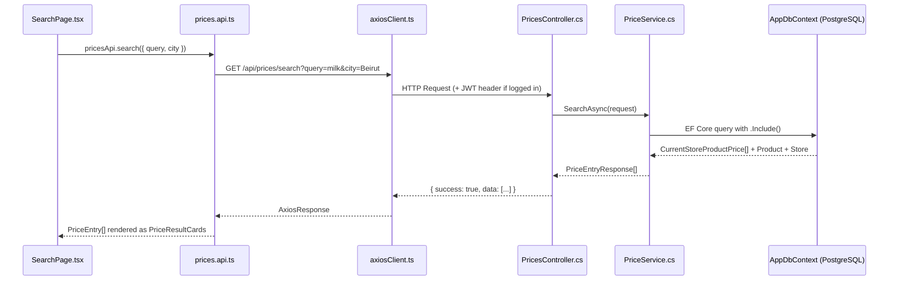

# 🛒 Building Your First .NET Endpoints: `/api/prices`
*Step-by-step guide — no code, just the roadmap.*

---

## Your Current State (What You Already Have)

| Layer | What Exists | What's Missing |
|:------|:------------|:---------------|
| **Models** | [Product](file:///c:/fyp/Lebanon-pricemap/lebanonpricemap.client/src/types/index.ts#62-73), [Store](file:///c:/fyp/Lebanon-pricemap/lebanonpricemap.client/src/types/index.ts#44-61), [CurrentStoreProductPrice](file:///c:/fyp/Lebanon-pricemap/LebanonPriceMap.Server/Models/CurrentStoreProductPrice.cs#7-48), [PriceSubmission](file:///c:/fyp/Lebanon-pricemap/LebanonPriceMap.Server/Models/PriceSubmission.cs#7-95), [PriceFeedback](file:///c:/fyp/Lebanon-pricemap/LebanonPriceMap.Server/Models/PriceFeedback.cs#7-33), [PriceConfirmation](file:///c:/fyp/Lebanon-pricemap/LebanonPriceMap.Server/Models/PriceConfirmation.cs#7-27), [Category](file:///c:/fyp/Lebanon-pricemap/LebanonPriceMap.Server/Models/Category.cs#8-26), [StoreCatalogItem](file:///c:/fyp/Lebanon-pricemap/LebanonPriceMap.Server/Models/StoreCatalogItem.cs#8-47) | ✅ All needed models exist |
| **DbContext** | [AppDbContext](file:///c:/fyp/Lebanon-pricemap/LebanonPriceMap.Server/Data/AppDbContext.cs#8-9) with only `Users` DbSet | ❌ Need to register all price-related tables |
| **DTOs** | [AuthDtos.cs](file:///c:/fyp/Lebanon-pricemap/LebanonPriceMap.Server/DTOs/AuthDtos.cs) (register/login) | ❌ Need price-specific request/response DTOs |
| **Services** | [AuthService.cs](file:///c:/fyp/Lebanon-pricemap/LebanonPriceMap.Server/Services/AuthService.cs) | ❌ Need `PriceService.cs` |
| **Controllers** | [AuthController.cs](file:///c:/fyp/Lebanon-pricemap/LebanonPriceMap.Server/Controllers/AuthController.cs) | ❌ Need `PricesController.cs` |
| **Frontend** | [prices.api.ts](file:///c:/fyp/Lebanon-pricemap/lebanonpricemap.client/src/api/prices.api.ts) with `USE_MOCK = true` | Just flip the flag to `false` when ready |

---

## The 5 Endpoints You're Building

| # | Method | Route | Auth? | DB Tables Involved |
|:-:|:-------|:------|:------|:-------------------|
| 1 | GET | `/api/prices/search` | Public | `current_store_product_prices` + `products` + `stores` + `categories` |
| 2 | GET | `/api/prices/product/{id}` | Public | `current_store_product_prices` + `stores` |
| 3 | GET | `/api/prices/{id}` | Public | `current_store_product_prices` + `products` + `stores` |
| 4 | POST | `/api/prices` | Shopper (JWT) | `price_submissions` + `users` |
| 5 | POST | `/api/prices/{id}/vote` | Shopper (JWT) | `price_submissions` (upvotes/downvotes) |

---

## Step-by-Step Roadmap

### Step 1: Register Tables in [AppDbContext.cs](file:///c:/fyp/Lebanon-pricemap/LebanonPriceMap.Server/Data/AppDbContext.cs)

> **File:** [AppDbContext.cs](file:///c:/fyp/Lebanon-pricemap/LebanonPriceMap.Server/Data/AppDbContext.cs)

Your [AppDbContext](file:///c:/fyp/Lebanon-pricemap/LebanonPriceMap.Server/Data/AppDbContext.cs#8-9) currently only has `DbSet<User> Users`. You need to add DbSets for all the tables these endpoints touch:

- `DbSet<Product> Products`
- `DbSet<Store> Stores`
- `DbSet<Category> Categories`
- `DbSet<CurrentStoreProductPrice> CurrentStoreProductPrices`
- `DbSet<PriceSubmission> PriceSubmissions`
- `DbSet<PriceFeedback> PriceFeedbacks`
- `DbSet<PriceConfirmation> PriceConfirmations`

Then in [OnModelCreating](file:///c:/fyp/Lebanon-pricemap/LebanonPriceMap.Server/Data/AppDbContext.cs#12-36), add `entity.ToTable("table_name")` + column mappings for each, **following the exact same pattern** you already have for [User](file:///c:/fyp/Lebanon-pricemap/lebanonpricemap.client/src/types/index.ts#27-43). Use your [schema.sql](file:///c:/fyp/Lebanon-pricemap/database/schema.sql) to get the exact table/column names (snake_case).

> [!IMPORTANT]
> Your schema uses **snake_case** (`current_store_product_prices`, `price_lbp`) but your C# models use **PascalCase** ([CurrentStoreProductPrice](file:///c:/fyp/Lebanon-pricemap/LebanonPriceMap.Server/Models/CurrentStoreProductPrice.cs#7-48), `PriceLbp`). The [OnModelCreating](file:///c:/fyp/Lebanon-pricemap/LebanonPriceMap.Server/Data/AppDbContext.cs#12-36) column mapping is what bridges this gap — don't skip it.

---

### Step 2: Create Price DTOs

> **File (new):** `DTOs/PriceDtos.cs`

You need DTOs to shape what the API sends/receives. **Never expose your raw models directly — always use DTOs.** Follow the same pattern as [AuthDtos.cs](file:///c:/fyp/Lebanon-pricemap/LebanonPriceMap.Server/DTOs/AuthDtos.cs).

#### DTOs to create:

| DTO Name | Purpose | Key Fields |
|:---------|:--------|:-----------|
| `PriceSearchRequest` | Query params for search | `Query`, `City`, `Sort`, `VerifiedOnly` |
| `PriceEntryResponse` | What the frontend expects back | Match the [PriceEntry](file:///c:/fyp/Lebanon-pricemap/lebanonpricemap.client/src/types/index.ts#74-102) interface from [types/index.ts](file:///c:/fyp/Lebanon-pricemap/lebanonpricemap.client/src/types/index.ts#L74-L101) |
| `PriceSubmitRequest` | Body for POST `/api/prices` | `ProductId`, `StoreId`, `PriceLbp`, `ReceiptImageBase64` |
| `PriceVoteRequest` | Body for POST vote | `VoteType` ("up" or "down") |
| `StoreDto` | Nested store in response | [Id](file:///c:/fyp/Lebanon-pricemap/lebanonpricemap.client/src/api/prices.api.ts#30-37), `Name`, `City`, `District`, ... |
| `ProductDto` | Nested product in response | [Id](file:///c:/fyp/Lebanon-pricemap/lebanonpricemap.client/src/api/prices.api.ts#30-37), `Name`, [Category](file:///c:/fyp/Lebanon-pricemap/LebanonPriceMap.Server/Models/Category.cs#8-26), `Unit`, ... |
| `ApiResponse<T>` | Standard wrapper | `Success`, `Data`, `Message`, `Error` |

> [!TIP]
> **Where to find the exact shape the frontend expects:** open [types/index.ts](file:///c:/fyp/Lebanon-pricemap/lebanonpricemap.client/src/types/index.ts) — the [PriceEntry](file:///c:/fyp/Lebanon-pricemap/lebanonpricemap.client/src/types/index.ts#74-102) interface (lines 74–101) is your contract. Your `PriceEntryResponse` DTO **must** match this shape so the frontend works without changes.

---

### Step 3: Create `PriceService.cs`

> **File (new):** `Services/PriceService.cs`

This is where **all the business logic** lives (not in the controller). Follow the pattern from [AuthService.cs](file:///c:/fyp/Lebanon-pricemap/LebanonPriceMap.Server/Services/AuthService.cs):

- Inject [AppDbContext](file:///c:/fyp/Lebanon-pricemap/LebanonPriceMap.Server/Data/AppDbContext.cs#8-9) via constructor
- Create one method per endpoint:

| Method | What It Does |
|:-------|:-------------|
| `SearchAsync(PriceSearchRequest)` | Query `CurrentStoreProductPrices` with `.Include(x => x.Product).Include(x => x.Store)`, filter by name/city, sort by price/date |
| `GetByProductAsync(Guid productId)` | Filter `CurrentStoreProductPrices` where `ProductId == id`, include [Store](file:///c:/fyp/Lebanon-pricemap/lebanonpricemap.client/src/types/index.ts#44-61) |
| `GetByIdAsync(Guid id)` | Single `.FirstOrDefaultAsync()` with includes |
| `SubmitAsync(PriceSubmitRequest, Guid userId)` | Create a new [PriceSubmission](file:///c:/fyp/Lebanon-pricemap/LebanonPriceMap.Server/Models/PriceSubmission.cs#7-95) row, set `SubmittedBy` = the JWT user |
| `VoteAsync(Guid id, PriceVoteRequest, Guid userId)` | Increment `Upvotes` or `Downvotes` on the [PriceSubmission](file:///c:/fyp/Lebanon-pricemap/LebanonPriceMap.Server/Models/PriceSubmission.cs#7-95) |

#### Key Query Details for Search:

- **Text search:** Use `.Where(x => x.Product.Name.Contains(query))` — EF Core translates this to `ILIKE` on PostgreSQL
- **City filter:** `.Where(x => x.Store.City == city)`  
- **Verified only:** `.Where(x => x.IsVerified == true)`
- **Sort by price:** `.OrderBy(x => x.CurrentPriceLbp)`
- **Include nested data:** `.Include(x => x.Product).ThenInclude(p => p.Category)` and `.Include(x => x.Store)`
- **Map to DTOs:** After querying, use `.Select()` or manual mapping to convert [CurrentStoreProductPrice](file:///c:/fyp/Lebanon-pricemap/LebanonPriceMap.Server/Models/CurrentStoreProductPrice.cs#7-48) → `PriceEntryResponse`

---

### Step 4: Register the Service in [Program.cs](file:///c:/fyp/Lebanon-pricemap/LebanonPriceMap.Server/Program.cs)

> **File:** [Program.cs](file:///c:/fyp/Lebanon-pricemap/LebanonPriceMap.Server/Program.cs)

Add one line right after the existing `AddScoped<AuthService>()`:

```
builder.Services.AddScoped<PriceService>();
```

---

### Step 5: Create `PricesController.cs`

> **File (new):** `Controllers/PricesController.cs`

Follow the [AuthController](file:///c:/fyp/Lebanon-pricemap/LebanonPriceMap.Server/Controllers/AuthController.cs) pattern:

- `[ApiController]` + `[Route("api/prices")]` attributes
- Inject `PriceService` via constructor
- 5 action methods:

| Attribute | Method | Notes |
|:----------|:-------|:------|
| `[HttpGet("search")]` | [Search([FromQuery] PriceSearchRequest)](file:///c:/fyp/Lebanon-pricemap/lebanonpricemap.client/src/pages/shopper/SearchPage.tsx#35-261) | Public — no `[Authorize]` |
| `[HttpGet("product/{id}")]` | `GetByProduct(Guid id)` | Public |
| `[HttpGet("{id}")]` | `GetById(Guid id)` | Public |
| `[HttpPost]` | `Submit([FromBody] PriceSubmitRequest)` | Add `[Authorize(Roles = "shopper")]` — extract user ID from JWT claims |
| `[HttpPost("{id}/vote")]` | `Vote(Guid id, [FromBody] PriceVoteRequest)` | Add `[Authorize(Roles = "shopper")]` |

#### Getting the User ID from JWT:

For the authenticated endpoints (POST), you need to extract the user ID from the claims. You already store it in the JWT as `ClaimTypes.NameIdentifier` (see [AuthService.cs line 102](file:///c:/fyp/Lebanon-pricemap/LebanonPriceMap.Server/Services/AuthService.cs#L102)).

Access it in the controller via:
```
User.FindFirst(ClaimTypes.NameIdentifier)?.Value
```

---

### Step 6: Test with Swagger

Your [Program.cs](file:///c:/fyp/Lebanon-pricemap/LebanonPriceMap.Server/Program.cs) already has Swagger configured (`AddSwaggerGen` + `UseSwaggerUI`). Once you build and run:

1. Navigate to `https://localhost:{port}/swagger`
2. You should see the `/api/prices/*` endpoints
3. Test the three GET endpoints directly (no auth needed)
4. For POST endpoints, first call `/api/auth/login`, copy the JWT, click "Authorize" in Swagger, paste it

---

### Step 7: Connect the Frontend

> **File:** [prices.api.ts](file:///c:/fyp/Lebanon-pricemap/lebanonpricemap.client/src/api/prices.api.ts)

The frontend is **already wired up** to call your backend. The only thing you need to do:

1. Change `USE_MOCK = true` → `USE_MOCK = false` (line 5)
2. Make sure your backend runs on the port that [axiosClient.ts](file:///c:/fyp/Lebanon-pricemap/lebanonpricemap.client/src/api/axiosClient.ts) points to (currently `http://localhost:5000/api`)

The frontend already calls:
- `client.get('/prices/search', { params })` → your `GET /api/prices/search`
- `client.get('/prices/product/{id}')` → your `GET /api/prices/product/{id}`
- `client.get('/prices/{id}')` → your `GET /api/prices/{id}`
- `client.post('/prices', data)` → your `POST /api/prices`

> [!NOTE]
> There is **no frontend call for `/api/prices/{id}/vote`** yet in [prices.api.ts](file:///c:/fyp/Lebanon-pricemap/lebanonpricemap.client/src/api/prices.api.ts). You'll need to add a `vote` method there when you're ready for that feature.

---

## Where to Find Frontend Data Contracts

Here's exactly where to look in the frontend to understand what shape the backend needs to return:

| What | File | Lines |
|:-----|:-----|:------|
| [PriceEntry](file:///c:/fyp/Lebanon-pricemap/lebanonpricemap.client/src/types/index.ts#74-102) interface (your main response shape) | [types/index.ts](file:///c:/fyp/Lebanon-pricemap/lebanonpricemap.client/src/types/index.ts) | L74–101 |
| [Store](file:///c:/fyp/Lebanon-pricemap/lebanonpricemap.client/src/types/index.ts#44-61) interface (nested in PriceEntry) | [types/index.ts](file:///c:/fyp/Lebanon-pricemap/lebanonpricemap.client/src/types/index.ts) | L44–60 |
| [Product](file:///c:/fyp/Lebanon-pricemap/lebanonpricemap.client/src/types/index.ts#62-73) interface (nested in PriceEntry) | [types/index.ts](file:///c:/fyp/Lebanon-pricemap/lebanonpricemap.client/src/types/index.ts) | L62–72 |
| `ApiResponse<T>` wrapper | [types/index.ts](file:///c:/fyp/Lebanon-pricemap/lebanonpricemap.client/src/types/index.ts) | L185–190 |
| How search is called (params shape) | [prices.api.ts](file:///c:/fyp/Lebanon-pricemap/lebanonpricemap.client/src/api/prices.api.ts) | L8–19 |
| How SearchPage consumes data | [SearchPage.tsx](file:///c:/fyp/Lebanon-pricemap/lebanonpricemap.client/src/pages/shopper/SearchPage.tsx) | L46–80 |
| The mock data (see what shape is used today) | [mockData.ts](file:///c:/fyp/Lebanon-pricemap/lebanonpricemap.client/src/api/mockData.ts) | Full file |

---

## Visual Summary: The Flow



---

## Checklist: Order of Work

- [ ] 1. Register DbSets in [AppDbContext.cs](file:///c:/fyp/Lebanon-pricemap/LebanonPriceMap.Server/Data/AppDbContext.cs) + add [OnModelCreating](file:///c:/fyp/Lebanon-pricemap/LebanonPriceMap.Server/Data/AppDbContext.cs#12-36) mappings
- [ ] 2. Create `DTOs/PriceDtos.cs` (match frontend [PriceEntry](file:///c:/fyp/Lebanon-pricemap/lebanonpricemap.client/src/types/index.ts#74-102) shape)
- [ ] 3. Create `Services/PriceService.cs` (5 methods)
- [ ] 4. Register `PriceService` in [Program.cs](file:///c:/fyp/Lebanon-pricemap/LebanonPriceMap.Server/Program.cs)
- [ ] 5. Create `Controllers/PricesController.cs` (5 endpoints)
- [ ] 6. Build & test via Swagger
- [ ] 7. Flip `USE_MOCK = false` in [prices.api.ts](file:///c:/fyp/Lebanon-pricemap/lebanonpricemap.client/src/api/prices.api.ts) and test end-to-end
